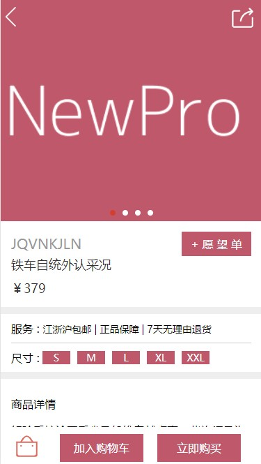

# mymall

## Project setup
```
npm install
```

### Compiles and hot-reloads for development
```
npm run serve
```

### Compiles and minifies for production
```
npm run build
```

### 页面效果展示




### Customize configuration

See [Configuration Reference](https://cli.vuejs.org/config/).
